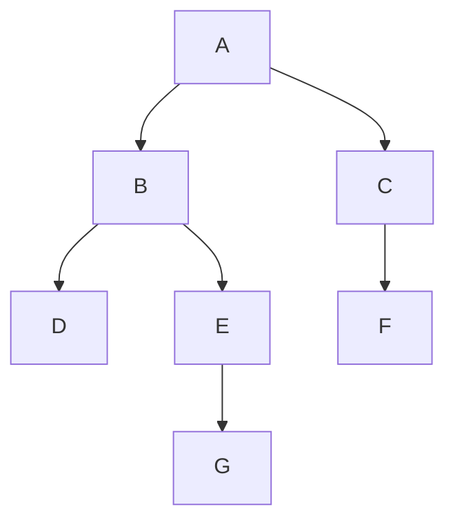

# 🏆 AI SEM 6 Practical & Viva Master Guide
**MUMBAI UNIVERSITY | COMPUTER ENGINEERING | CSL604**

---

## 📑 TABLE OF CONTENTS
1. [Search Algorithms (Exp 1-6)](#search-algorithms-exp-1-6)
2. [Optimization & GA (Exp 7-10)](#optimization--ga-exp-7-10)
3. [Prolog Family Tree (Exp 11)](#prolog-family-tree-exp-11)
4. [Block World & Wumpus World](#block-world--wumpus-world)
5. [First Order Logic (FOL)](#first-order-logic-fol)
6. [Top 50 Viva Q&A](#top-50-viva-qa)

---

## 🔍 SEARCH ALGORITHMS (EXP 1-6)

### 📌 Core Graph Configuration
Draw this tree for all search experiments.



### 📋 Search Comparison Table
| Algorithm | Data Structure | Complete | Optimal | Informed? |
| :--- | :--- | :--- | :--- | :--- |
| **DFS** | Stack | No | No | No |
| **BFS** | Queue | Yes | Yes (unit cost) | No |
| **DLS** | Stack | No | No | No |
| **DFID** | Stack | Yes | Yes (unit cost) | No |
| **Greedy** | Priority Queue | No | No | Yes (h only) |
| **A\*** | Priority Queue | Yes | Yes (h is admissible) | Yes (g + h) |

### ✍️ How to write Open/Close Lists (Example: BFS)
| Step | Current Node | OPEN List (Queue) | CLOSE List |
| :--- | :--- | :--- | :--- |
| 1 | - | [A] | [] |
| 2 | A | [B, C] | [A] |
| 3 | B | [C, D, E] | [A, B] |
| 4 | C | [D, E, F] | [A, B, C] |

---

## 🧬 OPTIMIZATION & GA (EXP 7-10)

### 🎯 Exp 7: Genetic Algorithm
**Equation:** $F(x) = (a + 2b + 3c + 4d) - 30$
**Requirement:** 6 Chromosomes.

1. **Fitness:** Distance from 30. $Fitness = |(a+2b+3c+4d) - 30|$. Lower is better (0 is optimal).
2. **Initial Population:** 6 random strings like `[2, 4, 1, 5]`.
3. **Crossover:** Single point swapping.
4. **Mutation:** Random bit/number change.

### 🧗 Exp 8: Hill Climbing
**Functions:** $y = \sin(x)$ OR $y = -x^2$ OR $y = -5x^2 + 3x + 6$.
*   **Key Concept:** Start at $x_0$, check $x_0 \pm step$. Move if value increases.
*   **Stopping Condition:** No neighbor is better (Local Maxima).

### 🧬 Exp 9 & 10: Crossover & Mutation
*   **One Iteration Only.**
*   **Crossover (25%):** Only pairs with random value $< 0.25$ perform crossover.
*   **Mutation (10%):** Each bit has a 10% chance to flip (0→1 or 1→0).

---

## 🌳 PROLOG FAMILY TREE (EXP 11)

### Logic Base
```prolog
% Facts
male(john). female(linda). parent(john, paul). parent(linda, paul).
% Rules
father(X, Y) :- parent(X, Y), male(X).
grandfather(X, Y) :- parent(X, Z), parent(Z, Y), male(X).
```

---

## 🏗️ BLOCK WORLD & WUMPUS WORLD

### Block World Predicates
*   `On(A, B)`: A is on B.
*   `Clear(A)`: Nothing is on top of A.
*   `OnTable(A)`: A is on the table.
*   `Holding(A)`: Robot arm is holding A.

### Wumpus World PEAS
*   **Performance:** +1000 Gold, -1000 Pit/Wumpus, -1 action, -10 arrow.
*   **Environment:** 4x4 grid, Pits, Wumpus, Gold.
*   **Actuators:** Forward, Turn, Grab, Shoot, Climb.
*   **Sensors:** Stench (Wumpus), Breeze (Pit), Glitter (Gold), Bump (Wall), Scream (Kill).

---

## 🤖 FIRST ORDER LOGIC (FOL)

### Quick Syntax
*   **All/Every:** $\forall x (Student(x) \rightarrow Intelligent(x))$
*   **Some/A:** $\exists x (Student(x) \land LikesCricket(x))$
*   **None:** $\neg \exists x (Student(x) \land LikesExam(x))$

---

## 💬 TOP VIVA QUESTIONS

1.  **What is Admissibility in A\*?**
    *   $h(n)$ never overestimates the actual cost to reach the goal.
2.  **What are the problems in Hill Climbing?**
    *   Local Maxima, Plateau, and Ridge.
3.  **Explain Crossover and Mutation in GA.**
    *   Crossover combines parent genes (Exploitation). Mutation changes a bit randomly (Exploration).
4.  **What is Unification in Prolog?**
    *   The process of matching variables with values or other variables.
5.  **Difference between Blind and Informed Search?**
    *   Blind search has no hint of goal location (BFS/DFS). Informed uses heuristics (A\*/Greedy).

---
**Best of luck for your exam!**
